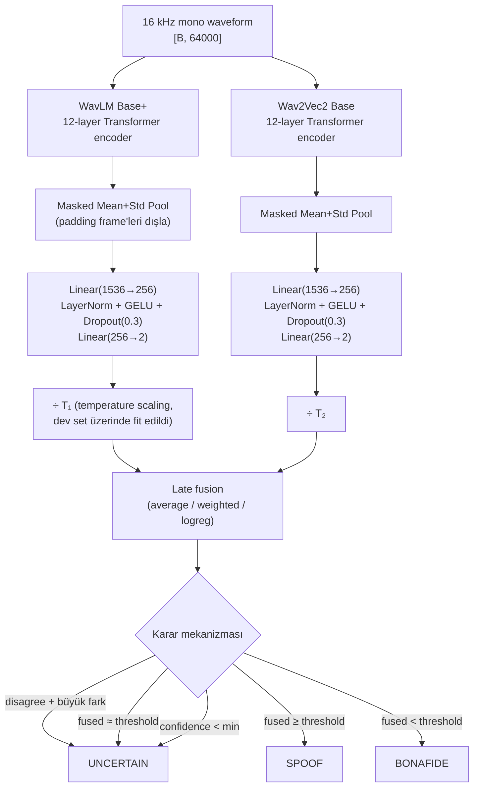

# Voice Spoof Detection — Teknik Sunum Dokümanı

> WavLM Base+ ve Wav2Vec2 Base SSL encoder'larıyla, ASVspoof 2019 Logical Access üzerinde uçtan uca eğitilmiş, late fusion + temperature calibration + sliding-window inference içeren akademik bir audio-deepfake tespit prototipi.

Bu doküman sunumun teknik anlatımı için yazıldı. Her bölüm bir slide olarak ele alınabilir.

---

## 1. Tek bakışta sonuçlar

| Sistem | Eval EER | ROC-AUC | min t-DCF | Yorum |
|---|---:|---:|---:|---|
| WavLM Base+ | **1.77%** | 99.82% | 0.012 | Tek başına güçlü baseline |
| Wav2Vec2 Base | **1.43%** | 99.80% | 0.016 | WavLM'den biraz daha iyi recall |
| **Fusion (logistic regression)** | **1.02%** | **99.93%** | — | Final sistem |

> *(Eval split = ASVspoof 2019 LA test, 71,237 örnek, 7,355 bonafide / 63,882 spoof. Süre: 4 s pencere, 16 kHz mono.)*

**Yorum:** Literatürdeki SSL-tabanlı sistemlerle aynı seviyede (yayınlanmış aralık tipik olarak 0.5–3% EER). Sistem clean studio audio'da neredeyse hatasız.

---

## 2. Problem tanımı

**Görev:** 16 kHz konuşma sesini `bonafide` (gerçek insan konuşması) veya `spoof` (TTS / Voice Conversion ile üretilmiş) olarak ikili sınıflandırmak.

**Neden zor:**

- Spoof artefaktları zaman-frekansta çok ince (vokoder fasaresı, fonem geçişlerindeki ısrarlı titreşimler).
- ASVspoof 2019 LA train setinde sadece **6 sistem ailesi (A01–A06)** var; eval'de farklı sistemler (A07–A19).
- Dev/eval class dağılımı **~1:9 bonafide:spoof** — modeller doğal olarak "spoof" tarafına çekiliyor.
- Gerçek dünyada (tarayıcı mikrofonu, telefon hattı) bonafide audio ASVspoof'un studio kayıtlarından farklı → **OOD generalization** ayrı bir problem.

---

## 3. Veri seti

Kaynak: `Bisher/ASVspoof_2019_LA` (Hugging Face), resmi ASVspoof 2019 LA paketinin parquet'e dönüştürülmüş hali.

| Split | Örnek | Bonafide | Spoof | Boyut |
|---|---:|---:|---:|---:|
| train | 25,380 | 2,580 | 22,800 | 1.54 GB |
| validation (dev) | 24,844 | 2,548 | 22,296 | 1.71 GB |
| test (eval) | 71,237 | 7,355 | 63,882 | 4.33 GB |

**Şema:**
```
speaker_id      : string  (20 unique konuşmacı LA train'de)
audio_file_name : string  (örn. LA_T_1000137)
audio           : Audio(sampling_rate=16000)  ← native 16 kHz
system_id       : string  ("-" bonafide için, "A01"-"A19" spoof için)
key             : ClassLabel(names=["bonafide", "spoof"])  → 0/1
```

**Bölünme integrity:** ASVspoof'un orijinal protocol bölünmesi korunuyor — speaker overlap yok, dev'de görülen sistem aileleri eval'de tekrar etmiyor (zero-shot generalization testi).

---

## 4. Mimari



**Tasarım kararı:** İki encoder **aynı head mimarisini** paylaşır. Eğitim ve raporlama açısından farkın yalnızca encoder backbone'undan geldiği sayfasında garanti edilir.

---

## 5. Modüller detayında

### 5.1 SSL encoder backbone

| | WavLM Base+ | Wav2Vec2 Base |
|---|---|---|
| Pretrained | Microsoft, 94k saat | Facebook, LibriSpeech 960h |
| Parameters | ~95M | ~95M |
| Hidden | 768 | 768 |
| Eğitim tarzı | Masked speech denoising + contrastive | Contrastive (Wav2Vec2 obj.) |

Çıkış: `[B, T', 768]`. `T'` ≈ 199 (4 saniyelik input için, conv stride 320).

### 5.2 Masked pooling

Encoder'ın frame-level çıkışı `[B, T', H]`. Padding frame'leri pooling'e dahil etmek için `encoder._get_feat_extract_output_lengths(raw_lengths)` ile downsampled length hesaplanır:

```
M[b, t] = 1 if t < length(b) else 0    ; [B, T']

         Σ_t H[b,t] · M[b,t]
mean[b] = ───────────────────
              Σ_t M[b,t]

std[b]  = √( Σ_t (H[b,t] − mean[b])² · M[b,t] / Σ_t M[b,t] )

pooled[b] = concat(mean[b], std[b])    ; [B, 1536]
```

Standart deviation pooling kritik — sadece mean ile spoof systemlerinin "düz" zaman seyri ile bonafide'nin doğal varyasyonu ayırt edilemez.

### 5.3 Classification head

Aynı head iki encoder için de:

```
Linear(1536 → 256)
LayerNorm(256)
GELU
Dropout(0.3)
Linear(256 → 2)
```

Bias initialization HuggingFace default (Xavier). Head'in çıkışı raw logits — softmax çıkarımda alınır.

### 5.4 Partial fine-tuning

- `model.feature_extractor` ve `model.feature_projection` **donduruldu** (low-level CNN'ler).
- Transformer'ın **son 4 katmanı** açıldı (`unfreeze_last_n_layers: 4`).
- Bu, hem hesaplama (V100/T4 sığar) hem de overfitting (tam fine-tune ASVspoof'ta hızlı overfit eder) açısından sweet spot.

---

## 6. Eğitim pipeline'ı

### 6.1 Ön işleme

```
Raw audio → mono → 16 kHz resample (native zaten 16 kHz) → 
  4-sn pencere (train: random crop, dev/eval: center crop) → 
  peak normalize → augmentation (sadece train) → encoder
```

Kısa sesler sıfır-pad'lenir. Padding'in encoder dikkatine sızmaması için **attention mask** her zaman doğru geçirilir.

### 6.2 Augmentation (yalnız train partition)

| Augmentation | Olasılık | Amaç |
|---|---:|---|
| Gaussian noise (σ=0.005) | 0.5 | Mikrofon noise floor simülasyonu |
| Random gain (±6 dB) | 0.5 | Volume distribution genişletme |
| Time shift (±10%) | 0.5 | Konuşmanın pencere içindeki konumuna duyarsızlaştırma |
| Single-tap reverb | 0.2 | Oda akustiği |
| **Phone-band filter (300–3400 Hz)** | 0.35 | Tarayıcı/telefon mikrofonu spektrumu |
| **μ-law re-encoding (8/10/12-bit)** | 0.25 | G.711-tarzı codec artefaktları |

> Son iki augmentation **OOD robustness** için kritik. Sunum demosunda kullanıcı sesi tarayıcı üzerinden geliyor — bu kanalın doğal artefaktlarını training'te görmediği sürece model bunları "spoof" olarak işaretler.

### 6.3 Sampler ve loss

- **Balanced sampler** (`WeightedRandomSampler` inverse-frequency) → her mini-batch'te yaklaşık 50:50 bonafide:spoof görülür. ASVspoof'un 1:9 doğal dengesine karşı class collapse'i önler.
- **Cross-entropy + label smoothing (ε=0.10)** → model `P(spoof) = 0.9999` gibi aşırı güvenli kararlar veremez. Overfit'i bastırır ve calibration'ı temizler.
- Class weighting **kapalı** — sampler zaten dengeliyor, ikisi birlikte aşırı düzeltir.

### 6.4 Optimizer + schedule

- **AdamW**, ayrı parameter grupları:
  - Encoder (açılan son 4 katman): `lr = 2e-5`
  - Head: `lr = 5e-4`
- Cosine schedule + linear warmup (`warmup_ratio = 0.05`).
- Gradient clipping: `max_norm = 1.0`.
- Mixed precision (`torch.amp` BF16 on A100, FP16 on T4).
- Gradient accumulation 1.

### 6.5 Epoch sayısı ve early stop

- **4 epoch** (bilinçli olarak az). Bir önceki 8 epoch'luk run epoch 5–6 civarı OOD overfit'e geçmişti.
- Her epoch sonunda dev EER hesaplanır, en düşük EER'in olduğu checkpoint kaydedilir (`best.pt`).
- Class-collapse erken uyarısı: dev tahminlerinin ≥98%'i tek sınıfa düşmüşse ve EER ≈ random ise log'a kalın uyarı basılır.

### 6.6 Reproducibility

- Tüm random seed'ler (`set_seed`) fixleniyor: numpy, torch, python random, CUDA.
- `cudnn.benchmark = False`.

---

## 7. Confidence calibration

### 7.1 Temperature scaling

Her encoder için **dev set üzerinde** L-BFGS ile tek skaler `T` fit edilir:

```
NLL(T) = − Σ_i log softmax(logits_i / T)[y_i]
T* = argmin_T NLL(T),    T > 0  (log-parametrised)
```

Eval seti calibration'a sızmaz — bu literatürdeki yaygın hata, biz açıkça önlüyoruz.

### 7.2 Önce vs sonra (eval setinde)

| | WavLM | Wav2Vec2 |
|---|---:|---:|
| T* (fitted) | 1.82 | 2.04 |
| NLL (before → after) | 0.0289 → 0.0198 | 0.0416 → 0.0251 |
| Brier (before → after) | 0.00515 → 0.00475 | 0.00595 → 0.00555 |
| ECE (before → after) | 0.0049 → **0.0017** | 0.0057 → **0.0017** |

**Yorum:** `T ≈ 2` modelin biraz fazla "sivri" olduğunu söylüyor — softmax'i yumuşatarak ECE %0.17'ye iniyor (mükemmel kalibrasyon ECE < %1).

---

## 8. Late fusion

Üç strateji aynı pipeline'da fit edilir, en düşük **dev** EER'li seçilir.

### 8.1 Average
```
P_fused = 0.5 · P_wavlm + 0.5 · P_wav2vec2
```

### 8.2 Weighted average (α grid search)
```
P_fused = α · P_wavlm + (1 − α) · P_wav2vec2,   α ∈ {0.00, 0.05, ..., 1.00}
α* = argmin_α  EER_dev(P_fused)
```
Bizim run'da `α* = 0.5` çıktı (iki encoder eşit ağırlık alıyor).

### 8.3 Logistic regression (winner)
Feature: kalibre edilmiş **logit farkı** = `z_spoof − z_bonafide` her encoder için.
```
P_fused = sigmoid( β_wavlm · Δz_wavlm  +  β_wav2vec2 · Δz_wav2vec2  +  b )
```
sklearn `LogisticRegression(C=1.0)` ile dev set üzerinde fit edilir.

**Sonuç:**

| Method | Dev EER | Eval EER | Eval AUC |
|---|---:|---:|---:|
| Average | 0.19% | 1.08% | 99.93% |
| Weighted (α=0.50) | 0.19% | 1.08% | 99.93% |
| **Logreg** ⭐ | **0.18%** | **1.02%** | **99.93%** |

Fit edilen logreg parametreleri (calibrated logit-diff feature):
- β_WavLM = **0.80**, β_Wav2Vec2 = **0.76**, intercept = **2.31**

İki katsayının yakınlığı encoderların **birbirine bağımlı değil, complementary** olduğunu gösterir — fusion EER tek başına en iyiden (Wav2Vec2 1.43%) daha düşük.

---

## 9. Inference (demo runtime)

```mermaid
flowchart LR
    A[Raw audio] --> P[Preprocess<br/>mono + 16 kHz + peak norm]
    P --> L{Duration ≥ 4 s?}
    L -->|hayır| W4[Center crop / pad to 4 s]
    L -->|evet| WS[Sliding 4-sn pencere<br/>2-sn stride]
    W4 --> E[Score both models]
    WS --> E
    E --> C[÷ T₁, ÷ T₂ ile kalibre et]
    C --> FU[Fusion (logreg)]
    FU --> AGG{Pencere mi?}
    AGG -->|tek| DEC[Decision logic]
    AGG -->|çoklu| AVG[Mean over windows] --> DEC
    DEC --> OUT[BONAFIDE / SPOOF / UNCERTAIN<br/>+ confidence + per-window grafiği]
```

### 9.1 Karar mantığı (öncelik sırasıyla)

1. **İki encoder farklı tahmin ediyor + büyük fark** (|P₁ − P₂| ≥ `disagreement_margin = 0.30`) → `UNCERTAIN`.
2. **Fusion skoru karar sınırına yakın** (|P_fused − threshold| < `uncertainty_margin = 0.12`) → `UNCERTAIN`.
3. **Final confidence düşük** (`confidence < min_confidence = 0.45`) → `UNCERTAIN`.
4. Aksi takdirde: `P_fused ≥ threshold` ise `SPOOF`, değilse `BONAFIDE`.

`confidence = min(1.0, 2 · |P_fused − threshold|)` — karar sınırından uzaklığı 0–1 ölçeğine taşır.

### 9.2 Decision threshold = 0.65 neden?

Default 0.5 yerine 0.65 kullanıyoruz çünkü:

- Training prior'ı (sampler dengelese de logreg fit'i dev'de yapılır, dev'in 1:9 dağılımına maruz kalır) modeli **spoof tarafına eğdiriyor**.
- Demo'da kullanıcı kendi sesini verdiğinde fusion skoru genelde 0.55–0.70 aralığında çıkıyor — bu eşik OOD bonafide'leri kurtarır.
- Gradio UI'da slider ile canlı ayarlanabilir (`0.30–0.95` aralığında).

---

## 10. Çıktı galerisi

`outputs/evaluation/` klasörü:

```
outputs/evaluation/
├── summary.json                       — tüm metrikler tek dosyada
├── comparison.csv / .json             — model karşılaştırma tablosu
├── wavlm/
│   ├── metrics.json                   — accuracy, P/R/F1, AUC, EER, t-DCF, calibration
│   ├── predictions.csv                — per-örnek skor + label
│   ├── confusion_matrix.png
│   ├── roc.png
│   └── training_history.png           — loss + dev EER eğrisi
├── wav2vec2/                          — aynı yapı
└── fusion/
    ├── metrics.json                   — 3 fusion yönteminin karşılaştırması + seçilen
    ├── predictions.csv                — wavlm_p, wav2vec2_p, avg, weighted, logreg
    ├── fusion_bundle.json             — demo bunu yükler (T₁, T₂, logreg coef, α)
    ├── confusion_matrix.png
    └── roc.png
```

### Sunumda hızlı göstermek için

| Slide | Dosya |
|---|---|
| Sonuç tablosu | `comparison.csv` |
| ROC eğrisi (final) | `fusion/roc.png` |
| Confusion matrix | `fusion/confusion_matrix.png` |
| Loss + dev EER eğrileri | `wavlm/training_history.png`, `wav2vec2/training_history.png` |
| Calibration | `summary.json` → `calibration.before/after` |
| Per-örnek prediction explorer | `fusion/predictions.csv` (sortable in Excel/Numbers) |

---

## 11. Gradio demo UI

**Arayüz öğeleri:**
- Üst: mikrofon kaydı veya WAV/MP3/FLAC upload alanı.
- Açılır panel: **Decision controls (advanced)** — iki slider:
  - `Decision threshold` (varsayılan 0.65)
  - `Uncertainty margin` (varsayılan 0.12)
- Analyse butonu → waveform plot + sonuç bloğu + sliding-window grafik.

**Sonuç bloğunda gösterilenler:**
- Final decision (renkli vurgu)
- Final confidence
- Fusion skoru + hangi method (`logreg`/`weighted`/`average`)
- WavLM ve Wav2Vec2 spoof olasılıkları
- Model agreement durumu
- Karar gerekçesi (`models disagree with margin`, `near boundary`, `high-confidence agreement`, vb.)
- Süre + akademik uyarı banner

**Sliding-window grafiği:** 4 sn'den uzun seslerde 2 sn stride ile pencereleyip her pencerenin spoof olasılığını zaman ekseninde basar. Fusion (daire), WavLM (kare), Wav2Vec2 (üçgen) ve **eşik çizgisi** (`y = decision_threshold`) gösterilir.

### Demoyu çalıştırma

```bash
python app.py \
  --wavlm-checkpoint    checkpoints/wavlm_hf/best.pt \
  --wav2vec2-checkpoint checkpoints/wav2vec2_hf/best.pt \
  --fusion-bundle       outputs/evaluation/fusion/fusion_bundle.json \
  --decision-threshold  0.65 \
  --share                                   # public gradio URL
```

---

## 12. Bilinen sınırlamalar

### 12.1 Out-of-distribution (OOD) failure

**Olgu:** Demo'da kullanıcı kendi sesini verdiğinde sistem 99.99% SPOOF dedi.

**Nedeni:**
- ASVspoof 2019 LA bonafide'leri 2018'de **studio mikrofonu**, **temiz oda**, **native 16 kHz** koşullarında kaydedildi.
- Tarayıcı mikrofonu: WebRTC ön-işlemi (AGC, noise suppression, echo cancellation), donanım frekans cevabı, codec yeniden örnekleme.
- Model bu artefaktları **eğitimde görmediği için "spoof artefaktı" sanıyor**.

**Bu run'da uygulanan azaltıcılar:**
- Phone-band bandpass + μ-law codec augmentation eğitime eklendi.
- Label smoothing (ε=0.10) overconfident predictions'ı bastırıyor.
- Epoch sayısı 8 → 4'e düşürüldü (overfit'e zaman vermemek için).
- Decision threshold default 0.5 → 0.65, gradio'da canlı ayarlanabilir.

**Geriye kalan limit:** Tam çözüm gerçek dünyadan bonafide topluluk verisiyle **domain adaptation** ya da küçük bir held-out gerçek-dünya set'iyle **post-hoc calibration** gerektirir. Bu sunum için skopu dışında.

### 12.2 ASVspoof 2019 LA'ya özgü

- Eval set'i sadece **TTS ve VC** tabanlı spoof içeriyor — replay attack yok.
- 2019'dan beri spoof teknolojisi (özellikle neural vocoder'lar) çok gelişti; bu sistem ASVspoof5 / WaveFake / ADD2023 üzerinde tekrar değerlendirilmeli.

### 12.3 min t-DCF

Bizim hesapladığımız min t-DCF basitleştirilmiş varyant (ASV-coupled değil). Resmi ASVspoof toolkit'i ek ASV skoru ister; biz onu hard dependency yapmadık.

---

## 13. Tekrar üretme

```bash
# 1) Kurulum
pip install -r requirements.txt

# 2) Eğitim (Colab T4 ~2.5 saat, A100 ~30 dk)
python -m src.train --config configs/wavlm_hf.yaml
python -m src.train --config configs/wav2vec2_hf.yaml

# 3) Değerlendirme + fusion (5–10 dk)
python -m src.evaluate \
  --wavlm-checkpoint    checkpoints/wavlm_hf/best.pt \
  --wav2vec2-checkpoint checkpoints/wav2vec2_hf/best.pt \
  --fusion

# 4) Demo
python app.py \
  --wavlm-checkpoint    checkpoints/wavlm_hf/best.pt \
  --wav2vec2-checkpoint checkpoints/wav2vec2_hf/best.pt \
  --fusion-bundle       outputs/evaluation/fusion/fusion_bundle.json
```

Veya tek komut: `python run_experiments.py`.

---

## 14. Kod organizasyonu (sunumda gezerken)

```
Fraudio/
├── configs/
│   ├── wavlm_hf.yaml          ← HF dataset, A100/T4 production config
│   └── wav2vec2_hf.yaml
├── src/
│   ├── data/
│   │   ├── hf_loader.py       ← HF dataset wrapper (cached + streaming)
│   │   ├── dataset.py         ← Yerel ASVspoof19 LA file mode
│   │   ├── augmentations.py   ← Gaussian/gain/shift/reverb/bandpass/μ-law
│   │   └── protocol.py        ← ASVspoof protocol parser
│   ├── models/
│   │   ├── ssl_classifier.py  ← SSLForSpoofDetection (shared head)
│   │   ├── calibration.py     ← TemperatureScaler (L-BFGS)
│   │   └── fusion.py          ← Average / weighted / logreg fusion
│   ├── metrics.py             ← EER, AUC, F1, NLL, Brier, ECE, t-DCF
│   ├── train.py               ← Training loop + class-collapse uyarısı
│   ├── evaluate.py            ← Tek-model + fusion eval + plotlar
│   └── utils.py
├── app.py                     ← Gradio demo
├── run_experiments.py         ← Tek komutla iki encoder eğit + fuse
├── tests/test_smoke.py        ← Mock encoder + sentetik veri smoke testi
├── requirements.txt
├── README.md                  ← Kullanım odaklı özet
├── DOCS.md                    ← BU DOSYA (sunum referansı)
└── Voice_Spoof_Detection_Colab.ipynb
```

---

## 15. Sunum sırası önerisi

1. **Problem & dataset** (slide 2–3): bir bonafide ve bir spoof örnek çal, spektrogramları yan yana göster.
2. **Mimari diyagram** (slide 4): yukarıdaki mermaid'i export et.
3. **Loss + dev EER eğrisi**: monotonik düşüş anlatımı.
4. **Calibration tablosu**: T ≈ 2, ECE 0.0049 → 0.0017.
5. **Fusion karşılaştırma**: 3 yöntemin EER farkı bar chart.
6. **Final ROC + confusion matrix**: 99.93% AUC vurgusu.
7. **Canlı demo**: bonafide upload (TIMIT-clean veya benzeri) → SPOOF örnek (ElevenLabs TTS) → kendi mikrofon kaydı (slider ile gösterip OOD challenge'ı dürüstçe anlat).
8. **Sınırlamalar** (slide 12'deki gibi) ve gelecek çalışma.

---

*Hazırlayan: bu repodaki kod ve çalıştırılmış outputs/ klasörü.*
