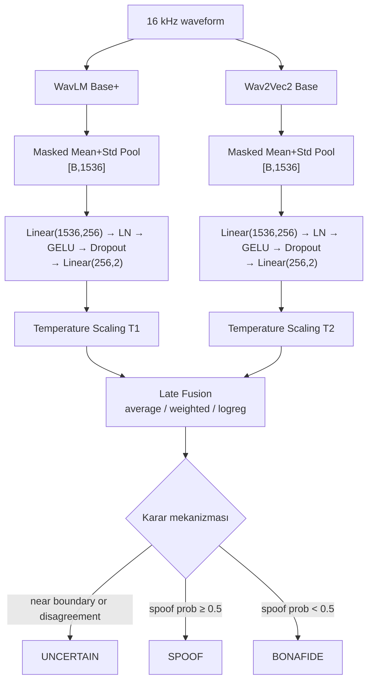

# Voice Spoof Detection — WavLM + Wav2Vec2 (Akademik PoC)

Bu repo, **ASVspoof 2019 Logical Access (LA)** veri seti üzerinde iki farklı SSL encoder'ı (WavLM Base+, Wav2Vec2 Base) **aynı classification head** ile karşılaştıran ve **late fusion** ile birleştiren uçtan uca bir prototiptir. Gradio tabanlı bir canlı demo da içerir.

> Bu sistem akademik bir prototiptir; güvenlik açısından kesin kanıt üretmez.

## Mimari



## Kurulum

```bash
pip install -r requirements.txt
```

Colab T4 üzerinde mixed precision ile çalışır. Yerel kurulumda PyTorch'u CUDA sürümünüze göre kurun.

## Dataset

ASVspoof 2019 LA paketi resmi sayfasından indirilir:
<https://datashare.ed.ac.uk/handle/10283/3336>

İndirip aşağıdaki yapıya çıkarın:

```
LA/
  ASVspoof2019_LA_train/flac/<FILE_ID>.flac
  ASVspoof2019_LA_dev/flac/<FILE_ID>.flac
  ASVspoof2019_LA_eval/flac/<FILE_ID>.flac
  ASVspoof2019_LA_cm_protocols/
      ASVspoof2019.LA.cm.train.trn.txt
      ASVspoof2019.LA.cm.dev.trl.txt
      ASVspoof2019.LA.cm.eval.trl.txt
```

`configs/*.yaml` içinde `data.dataset_root` değerini bu `LA/` klasörünü gösterecek şekilde değiştirin veya CLI ile `--dataset_root /path/to/LA` geçin.

Hızlı denemeler için `--max_samples` veya `--quick` bayrağı her partition'dan sınıf-dengesinde subsample alır.

## Eğitim

```bash
# WavLM
python -m src.train --config configs/wavlm.yaml --dataset_root /path/to/LA

# Wav2Vec2
python -m src.train --config configs/wav2vec2.yaml --dataset_root /path/to/LA

# Frozen encoder modu istersen config içinde model.freeze_encoder: true yap.
```

Encoder donduğunda yalnızca head eğitilir (`encoder_lr` etkisiz). Partial fine-tune modunda `model.unfreeze_last_n_layers` ile son N transformer katmanı açılır; iki ayrı LR grubu (`encoder_lr`, `head_lr`) AdamW + cosine schedule + gradient clipping ile kullanılır. `mixed_precision: true` Colab T4 için varsayılan.

## Değerlendirme + Fusion

```bash
python -m src.evaluate \
  --wavlm-checkpoint   checkpoints/wavlm/best.pt \
  --wav2vec2-checkpoint checkpoints/wav2vec2/best.pt \
  --dataset_root /path/to/LA \
  --fusion
```

Üretilen çıktılar (`outputs/evaluation/` altında):

| Dosya | İçerik |
|---|---|
| `wavlm/metrics.json`, `wav2vec2/metrics.json` | Accuracy, Precision, Recall, F1, ROC-AUC, EER, confusion matrix, min t-DCF, calibration (NLL/Brier/ECE before & after) |
| `wavlm/predictions.csv`, `wav2vec2/predictions.csv` | `file_id, system_id, label, spoof_prob, spoof_prob_calibrated` |
| `wavlm/confusion_matrix.png`, `roc.png`, `training_history.png` | Görseller |
| `fusion/metrics.json` | Üç fusion yönteminin dev EER + eval metrikleri ve seçilen "best" yöntem |
| `fusion/predictions.csv` | Tüm modellerin ve fusion'ların tahmin skorları |
| `fusion/fusion_bundle.json` | Demo'nun yükleyeceği seçili fusion + sıcaklık değerleri |
| `comparison.csv` / `.json` | Karşılaştırma tablosu |
| `summary.json` | Birleşik özet |

Fusion her zaman **kalibre edilmiş skorlar** üzerinde çalışır. Evaluation seti calibration veya fusion-ağırlığı seçiminde **kullanılmaz** — bunlar yalnızca development setinde belirlenir.

## Tek komutta iki modeli eğit + fuse et

```bash
python run_experiments.py --dataset_root /path/to/LA           # full run
python run_experiments.py --dataset_root /path/to/LA --quick   # 256 sample / partition
```

## Demo

```bash
python app.py \
  --wavlm-checkpoint   checkpoints/wavlm/best.pt \
  --wav2vec2-checkpoint checkpoints/wav2vec2/best.pt \
  --fusion-bundle      outputs/evaluation/fusion/fusion_bundle.json
```

Arayüzde:

* Mikrofon kaydı veya WAV/MP3/FLAC yükleme
* Waveform görseli
* Final karar (BONAFIDE / SPOOF / **UNCERTAIN**)
* Final confidence ve fusion skoru
* WavLM ve Wav2Vec2 skorları
* Model agreement/disagreement durumu
* 4 sn'den uzun seslerde 4 s pencere / 2 s stride ile zaman ekseninde spoof skoru grafiği

## Metrik tanımları

* **Accuracy** — eşik 0.5 ile sınıflandırma doğruluğu.
* **Precision/Recall/F1 (spoof)** — pozitif sınıf "spoof".
* **ROC-AUC** — eşikten bağımsız ayırt edicilik.
* **EER** — FPR = FNR olduğu hata oranı; düşük = iyi.
* **min t-DCF** — basitleştirilmiş tDCF (ASV bileşeni içermez; bağımlılığı opsiyonel).
* **NLL / Brier / ECE** — confidence calibration kalitesi.

## Fusion yaklaşımı

1. **Simple average** — `0.5 · P_wavlm + 0.5 · P_wav2vec2`.
2. **Weighted average** — `α` dev setinde 0.0–1.0 arasında 21 noktada taranır, en düşük dev EER seçilir.
3. **Logistic regression** — kalibre edilmiş logit farkları (`z_spoof − z_bonafide`) iki feature olarak küçük bir lojistik regresyona verilir.

Üç yöntem dev EER'ine göre kıyaslanır; en iyisi `fusion_bundle.json` içine yazılır ve demo onu kullanır.

### Belirsiz karar mantığı

`UNCERTAIN` etiketi üç koşuldan herhangi biri sağlandığında üretilir:

1. İki model farklı sınıf tahmin ediyor **ve** `|P_wavlm − P_wav2vec2| ≥ disagreement_margin` (varsayılan 0.30).
2. `|fusion − 0.5| < uncertainty_margin` (varsayılan 0.10).
3. Final confidence (`2·|fusion−0.5|`) `min_confidence` altında (varsayılan 0.55).

Eşikler `configs/*.yaml` içinde `inference:` bloğundan değiştirilebilir.

## Bilinen sınırlamalar

* min t-DCF tam ASV-coupled versiyonu yerine basitleştirilmiş varyantını üretir.
* MP3/codec simülasyonu varsayılan kapalı (`reverb_prob: 0.0`); cheap synthetic reverb sağlanır.
* Pretrained encoder ağırlıkları Hugging Face Hub'dan indirilir; Colab'da ilk eğitim ~50 MB indirme gerektirir.
* Eğitim Hugging Face `transformers.WavLMModel/Wav2Vec2Model` üzerine kurulu; sürüm uyumsuzluğu olursa `_get_feat_extract_output_lengths` API'si değişebilir.
* Quick mode (`--quick`) sayısal sonuçların güvenilirliği yerine pipeline doğrulamak içindir.

## Proje yapısı

```
voice-spoof-detection/
├── configs/
│   ├── wavlm.yaml
│   └── wav2vec2.yaml
├── src/
│   ├── data/
│   │   ├── dataset.py
│   │   ├── protocol.py
│   │   └── augmentations.py
│   ├── models/
│   │   ├── ssl_classifier.py
│   │   ├── calibration.py
│   │   └── fusion.py
│   ├── metrics.py
│   ├── train.py
│   ├── evaluate.py
│   └── utils.py
├── tests/
│   └── test_smoke.py
├── app.py
├── run_experiments.py
├── requirements.txt
├── README.md
└── Voice_Spoof_Detection_Colab.ipynb
```

## Colab notebook

`Voice_Spoof_Detection_Colab.ipynb` dosyasını Colab'da aç → GPU runtime seç → hücreleri sırayla çalıştır. Notebook kurulum, Drive mount, protocol doğrulaması, eğitim, evaluation, fusion, grafik üretimi ve Gradio demoyu sırayla kapsar.
